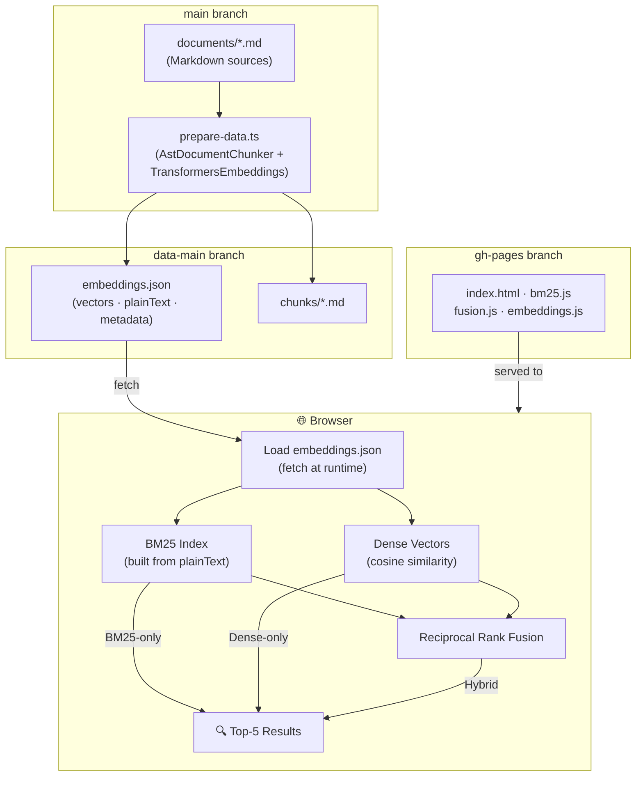

# ChromaDB Eval - Vector Search Webapp

This is a browser-based semantic search application that demonstrates vector search capabilities entirely in the browser using JavaScript and transformers.js.

## Features

- **Browser-only vector database**: No server required, all processing happens in the browser
- **LLM-based embeddings**: Uses `@huggingface/transformers` with the same model as the backend (`Xenova/all-mpnet-base-v2`)
- **Hybrid retrieval**: Combines dense semantic search and BM25 lexical search via Reciprocal Rank Fusion (RRF)
- **Real-time search**: Find the top 5 most similar document chunks to your query using the selected retrieval mode
- **Similarity scores**: Shows percentage match for each result
- **Content preview**: View chunk content with expand/collapse functionality
- **Links to source**: Direct links to view full chunks and documents on GitHub

## Retrieval Modes

The search supports three modes selectable from the dropdown next to the search box:

| Mode | Algorithm | Best for |
|---|---|---|
| **Hybrid** (default) | Dense + BM25 fused via RRF | General queries |
| **Dense (Semantic)** | Cosine similarity over embeddings | Conceptual queries |
| **BM25 (Lexical)** | In-browser BM25 keyword index | Filenames, symbols, error messages |

The BM25 index is built once at page load from `plainText` fields in `embeddings.json` and logged to the browser console.

## How It Works

1. **Data Loading**: The app loads pre-computed embeddings from the `data-main` branch
   - Embeddings are generated by the `prepare-data.ts` script
   - Stored in `embeddings.json` with metadata for each chunk

2. **Model Initialization**: Loads the same embedding model used by the backend
   - Uses `@huggingface/transformers` CDN for zero-install experience
   - Model: `Xenova/all-mpnet-base-v2` (768-dimensional vectors)

3. **Query Processing**: When you enter a search query:
   - Selects the retrieval mode from the dropdown (Hybrid / Dense / BM25)
   - **Dense / Hybrid**: Computes embedding for your query using transformers.js, calculates cosine similarity
   - **BM25 / Hybrid**: Scores documents using the pre-built BM25 keyword index
   - **Hybrid**: Fuses dense and BM25 rankings via Reciprocal Rank Fusion (RRF, k=60)
   - Returns top 5 most similar chunks with similarity scores

4. **Results Display**: Shows matching chunks with:
   - Similarity percentage
   - Chunk metadata (index, size, section)
   - Content preview (expandable)
   - Links to view full content on GitHub

## Architecture

- **Pure HTML/CSS/JavaScript**: No build step required
- **ES6 Modules**: Uses modern JavaScript with native module imports
- **CDN Dependencies**: `@huggingface/transformers` loaded from CDN
- **Static Hosting**: Can be served from GitHub Pages or any static host

## Data Flow



## Local Development

To test locally, simply open `index.html` in a modern browser. Note that:
- You need an internet connection to load transformers.js from CDN
- The embeddings are loaded from the `data-main` branch on GitHub
- CORS is not an issue since GitHub raw content allows cross-origin requests

Alternatively, serve with a local server:

```bash
cd webapp
python3 -m http.server 8080
# or
npx serve
```

Then open http://localhost:8080 in your browser.

## GitHub Pages Deployment

The webapp is automatically deployed to GitHub Pages by the `.github/workflows/deploy-gh-pages.yml` workflow:

1. Triggers on push to main when webapp files change
2. Copies the webapp directory to the gh-pages branch
3. GitHub Pages serves the content at `https://[username].github.io/[repo]/`

## Configuration

The app is configured to load data from:
- Owner: `huberp`
- Repo: `chromadb-eval`
- Branch: `data-main`
- File: `embeddings.json`

To use with your own repository, update the `OWNER` and `REPO` constants in `index.html`.

## Browser Compatibility

Requires a modern browser with:
- ES6 module support
- Fetch API
- WebAssembly (for transformers.js)

Tested on:
- Chrome 90+
- Firefox 89+
- Safari 15+
- Edge 90+
